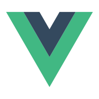

👋 Hi，there！

### (*´▽｀)ノノ✨✨

Besides being a programmer, I am also a cycling enthusiast.
<button style="display:inline-block;background-color:#FC5200;color:#fff;padding:5px 10px 5px 30px;font-size:11px;font-family:Helvetica, Arial, sans-serif;white-space:nowrap;text-decoration:none;background-repeat:no-repeat;background-position:10px center;border-radius:3px;background-image:url('https://badges.strava.com/logo-strava-echelon.png')" href='https://strava.com/athletes/124289531' target="_clean">
  Follow me on
  
</button>

<!-- Basemap -->

--

<!-- Skills -->
<code></code>
<code></code>
<code></code>
<code></code>
<code></code>
--
